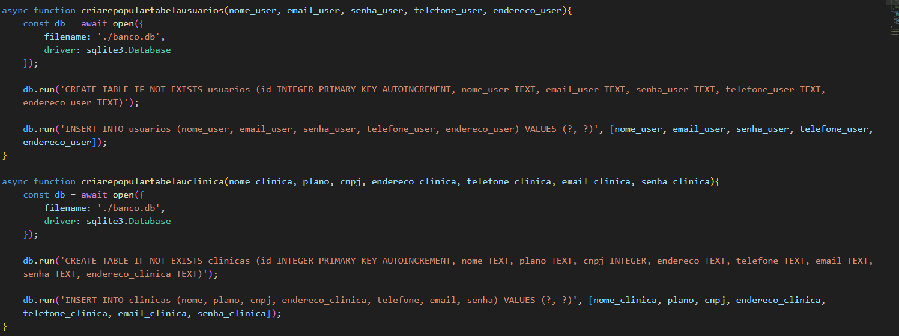

# Entregável 1

O código abaixo cria e popula as tabelas usuário e clínica:  

async function criarepopulartabelausuarios(nome_user, email_user, senha_user, telefone_user, endereco_user){   
async: faz a função abrigar funções assíncronas  

const db = await open ({  
        filename: './banco.db',  
        driver: sqlite3.Database  
    });  

await: faz com que a operação seja assíncrona, para o código não fica travado  
open: abre uma conexão com o banco de dados  
filename: pede o caminho para o banco de dados  
driver: pede a biblioteca encarregada de fazer a conexão e realizar as operações  

db.run('CREATE TABLE IF NOT EXISTS usuarios (id INTEGER PRIMARY KEY AUTOINCREMENT, nome_user TEXT, email_user TEXT, senha_user TEXT, telefone_user TEXT, endereco_user TEXT)');  
* Cria a tabela "usarios", se ela não existir, e seus atributos  

db.run('INSERT INTO usuarios (nome_user, email_user, senha_user, telefone_user, endereco_user) VALUES (?, ?, ?, ?, ?)', [nome_user, email_user, senha_user, telefone_user, endereco_user]);  
* Insere valores na tabela "usuarios"

